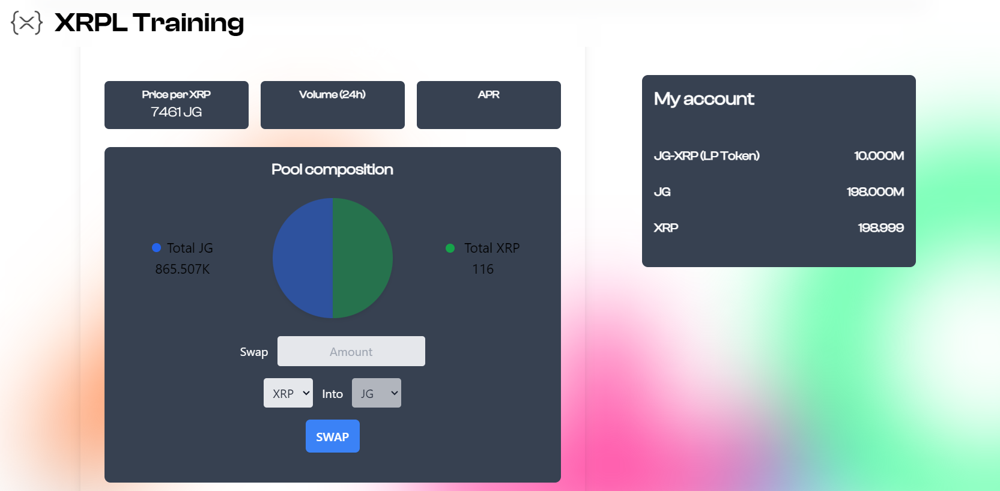
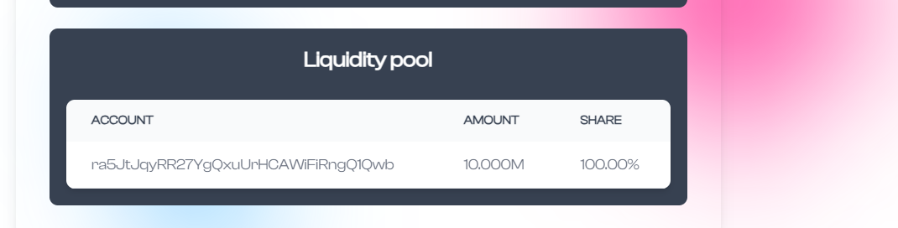

# XRPL Training

## First Day

### Docs

https://github.com/XRPL-Commons/xrpl-training-april-2024

https://testnet.xrpl.org/accounts/rLeYKKxAcYrvBPvw69AMdHyGEAiZrCGrZu

### Liquidity Pools

## Second Day

### EVM Side Chain

### Docs

https://opensource.ripple.com/docs/evm-sidechain/intro-to-evm-sidechain/

https://bridge.devnet.xrpl.org

https://wizard.openzeppelin.com/

https://github.com/Peersyst/xrpl-commons-workshop

### Result

hardhat run --network evmSidechain scripts/deploy-token.ts

XRPLCommonsToken address:  0xC85356E3da0f18da377C317440024cc72b2603ae

use npm install --save-dev ethers@5.7.2 to send to the mainchain